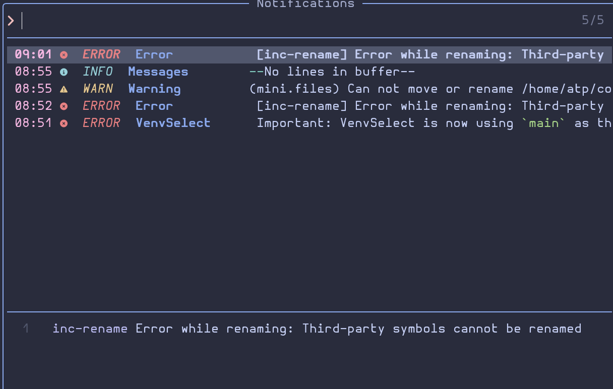

# Setup details

## pyrefly

```bash
pyrefly --version

>> pyrefly 0.45.2
```

## Python

```bash
python --version

>> Python 3.13.5
```

## nvim

```bash
nvim -v

>> NVIM v0.11.5
>> Build type: RelWithDebInfo
>> LuaJIT 2.1.1741730670
```

# Reproduce the bug

To reproduce the bug, go to `__init__.py` and trigger a rename on `main` (ie `<leader>cr`).

## LspLog

```
[ERROR][2025-12-12 08:52:03] ...p/_transport.lua:36 "rpc" "pyrefly" "stderr" " INFO Handling non-canceled request textDocument/prepareRename (12)\n INFO Language server processed event `LspRequest(textDocument/prepareRename)` in 0.00s (0.00s waiting)\n INFO Handling non-canceled request textDocument/references (13)\n INFO Language server processed event `LspRequest(textDocument/references)` in 0.00s (0.00s waiting)\n"
[ERROR][2025-12-12 08:52:03] ...p/_transport.lua:36 "rpc" "pyrefly" "stderr" " INFO Ran task on find_reference_queue heavy task queue. Queue time: 0.00, task time: 0.00\n"
[ERROR][2025-12-12 08:52:05] ...p/_transport.lua:36 "rpc" "pyrefly" "stderr" " INFO Handling non-canceled request textDocument/rename (14)\n INFO Language server processed event `LspRequest(textDocument/rename)` in 0.00s (0.00s waiting)\n"

```

## Screenshot


